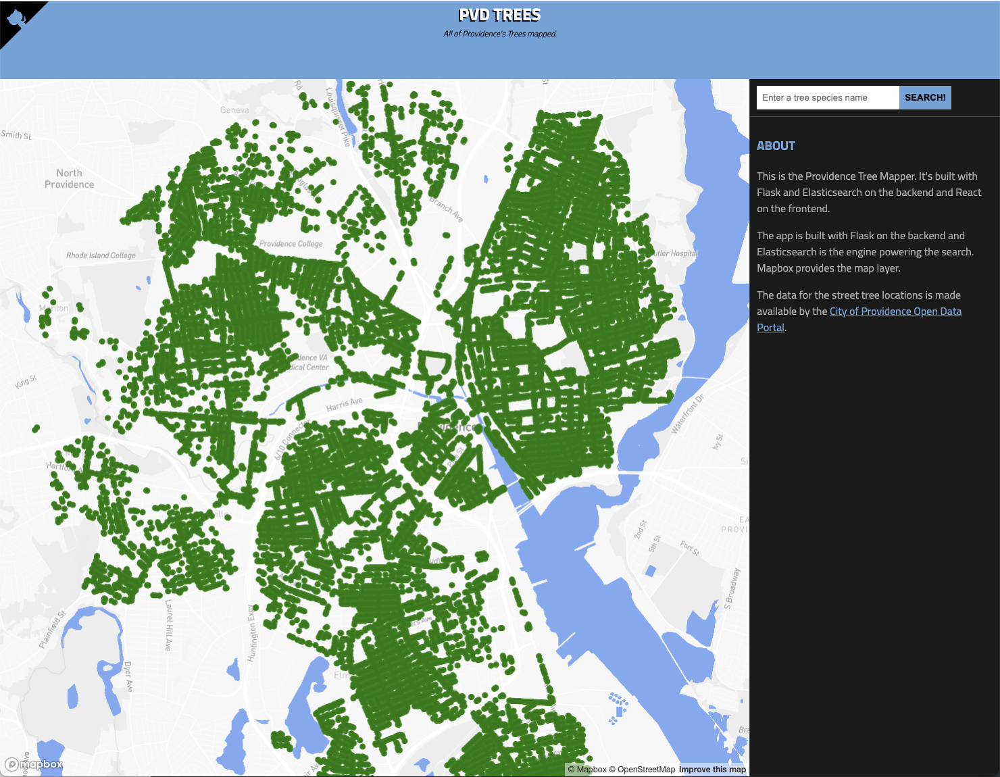

PVD Street Trees
===

> Providence's Street Trees

In 2003, I purchased a home on the west side of Providence in the Federal Hill neighborhood. The streets were completely bare, and the heat in the summer was unbearable. Soon after I moved in, I began volunteering with the [Providence Neighborhood Planting Program](https://www.pnpp.org/). Started in the mid-80s by Peggy Sharpe, the non-profit organization has since planted over 14,000 trees on the streets of Providence. To see the impact their work has made, you can now visualize the street tree cover that has brought shade and cooler summertime temperatures to thousands of Providence residents using this application.  



This is a test application for use with Gordian Knot interview processes. (http://gordianknot.company) The test application is the base from which tests will be designed and conducted. Each test will be unique to the role. This app is built with [Flask](http://flask.pocoo.org/) on the backend and [Elasticsearch](http://elastic.co/) is the search engine powering the searches. The front-end is built with [React](http://facebook.github.io/react/) and the maps are courtesy of [Mapbox](https://www.mapbox.com/). For custom tests, the tech stack may differ in order to more closely model what a particular organization uses

The data for the street trees is made available in the public domain by [Providence Open Data Portal](https://data.providenceri.gov/Neighborhoods/Providence-Tree-Dataset/b77h-59tz/).

### Getting Started

Install Docker, and then run 
```
$ docker-compose up
```
in your terminal to begin. You can access the web interface on port 5000. 
